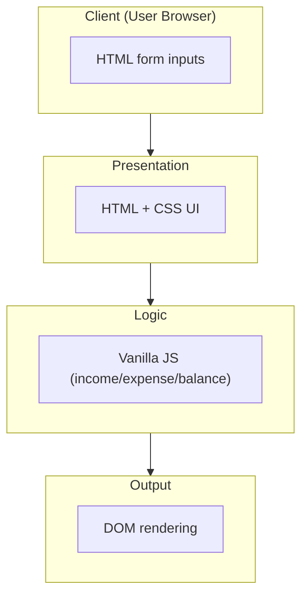
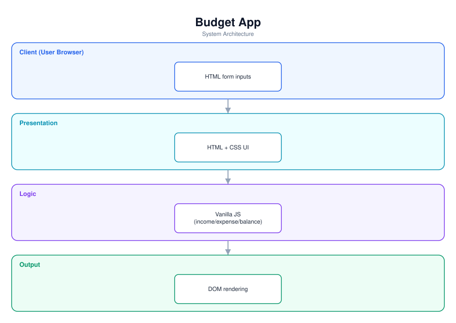

# Budget App — Software Documentation

> A simple browser budget tool built with vanilla HTML, CSS, and JavaScript.

**Repository:** [`MyBudgetAPP`](https://github.com/Monametsi-s/MyBudgetAPP)  
**Type:** Static client-side web application  
**Status:** Complete / functional (basic)

---

## 1. Overview

Budget App is a lightweight personal-finance tool built with plain HTML, CSS, and JavaScript. Users enter income and expenses and the app calculates and displays a running balance. It demonstrates core front-end fundamentals without any framework or backend.

## 2. System Architecture

The diagram below shows the high-level architecture and how data flows between layers. It renders automatically on GitHub (Mermaid) and is also committed as a vector image ([`architecture.svg`](architecture.svg)).



<p align="center"></p>

### 2.1 Component responsibilities

| Layer | Responsibility |
|---|---|
| **Client** | User enters income and expenses. |
| **Presentation** | Static HTML/CSS interface. |
| **Logic** | Vanilla JS calculates balances and updates state. |
| **Output** | Renders results directly to the DOM. |

## 3. Technology Stack

| Area | Technology |
|---|---|
| Markup | HTML |
| Styling | CSS |
| Logic | Vanilla JavaScript |

## 4. Assumed User Requirements

_These requirements are inferred from the project's purpose and feature set; they document the intended behaviour rather than a formally agreed specification._

### 4.1 Functional requirements

- **FR-01** — Add income entries.
- **FR-02** — Add expense entries.
- **FR-03** — Calculate and display the current balance automatically.
- **FR-04** — Present a clean, simple interface.

### 4.2 Representative user stories

- As a user, I want to quickly see my balance after adding income and expenses.
- As a learner, I want a clear example of DOM manipulation.
- As a user, I want a no-friction tool with nothing to install.

### 4.3 Non-functional requirements

- Calculations must update immediately on input.
- The page must work without any build step.
- The UI should be simple and intuitive.

## 5. Assumed System Requirements

### 5.1 End-user (runtime) requirements

- Any modern web browser; works offline once loaded.

### 5.2 Server / hosting requirements

- None — this project runs entirely on the client; no application server is required.

### 5.3 External services & API keys

- None — the application has no third-party service dependencies at runtime.

### 5.4 Developer / build requirements

- A browser and a text editor; optionally a static server (e.g. Live Server) for local development.

## 6. Data Model

State is held in memory in JavaScript (arrays of income and expense amounts); no persistence by default.

## 7. Setup & Installation

```bash
git clone https://github.com/Monametsi-s/MyBudgetAPP.git
cd MyBudgetAPP
# open index.html in a browser (or use a static server)
```

## 8. Assumptions & Future Considerations

- Add localStorage so data survives refresh.
- Add expense categories and a chart.
- Deploy via GitHub Pages.

---

<sub>This document was generated as part of a portfolio-wide documentation pass. User and system requirements are **assumed** from the codebase, README, and project intent, and should be validated against real product goals before being treated as authoritative.</sub>
